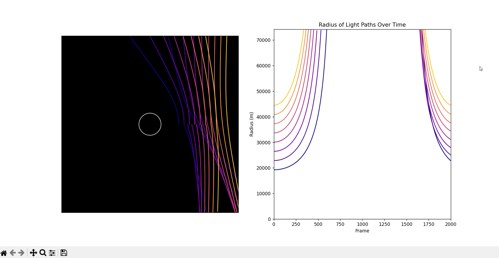

# 🌌 Black Hole Gravitational Lensing Simulation

This project simulates the gravitational lensing effect caused by a black hole using Python. It visualizes the bending of light around a black hole using general relativity principles.

## ✨ Features

- 📡 **Gravitational Lensing Simulation**: Simulates how light bends around a black hole.
- ⚙️ **Schwarzschild Metric Calculation**: Uses Schwarzschild radius and geodesic equations.
- 🎥 **Animated Visualization**: Displays real-time light paths.
- 📊 **Dual Plots**: One plot for light bending and another for the radius evolution.
- 🚀 **Optimized Performance**: Efficient computation with SciPy's `odeint`.

## 🛠 Installation

Ensure you have Python installed, then install the required dependencies:

`pip install numpy matplotlib scipy`

## 🖥 Output Visualization
